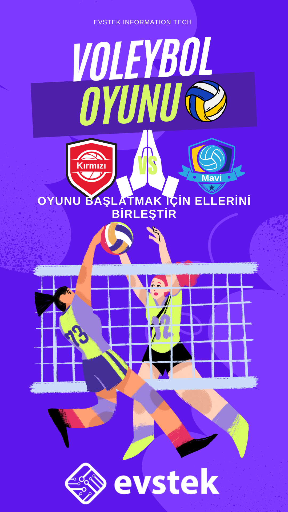
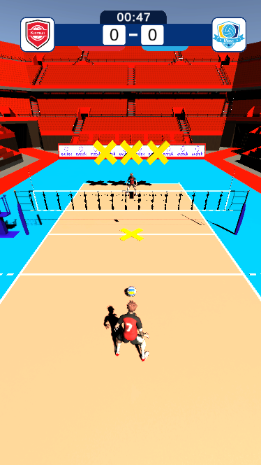
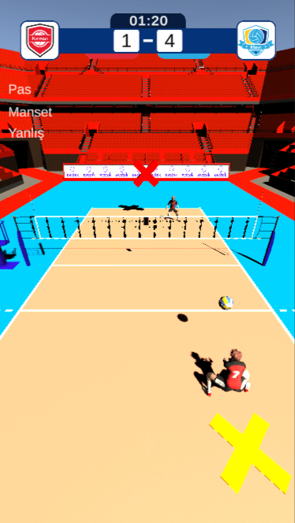
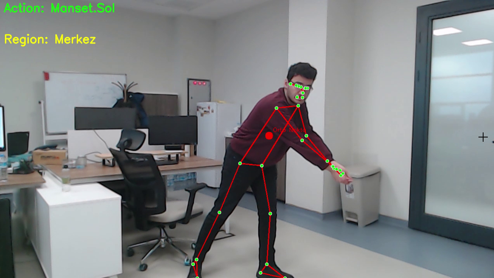

# Volleyball Game 🏐

**Tek kişilik, hareket algılama tabanlı voleybol oyunu.**  
Oyuncu, **kamera karşısındaki fiziksel hareketleriyle** karakteri kontrol eder ve bot rakip ile mücadele eder.  
Oyun, Unity ve C# kullanılarak geliştirilmiştir.  

> **Not:** Bu proje bir TÜBİTAK destekli Ar-Ge çalışmasının parçasıdır.  
> Kodlar ticari gizlilik nedeniyle paylaşılmamaktadır.  
> Bu sayfa yalnızca **tanıtım** ve **görsel içerik** sunar.

---

## 🎯 Hakkında
Bu oyun, kullanıcıların kamera karşısında yaptıkları hareketleri kullanarak bir voleybol karakterini kontrol etmelerine olanak tanır.  
Oyuncu gerçek hayatta **smash, pas veya manşet** gibi vuruşlar yapar.  
Bu hareketler, yapay zeka algoritması tarafından **analiz edilerek yön bilgisiyle birlikte Unity’ye aktarılır**.  
Böylece Unity içindeki karakter, oyuncunun yaptığı vuruşu **aynı tür ve aynı yönde** gerçekleştirir.

**Ana hedefler:**
- Fiziksel spor deneyimini dijital bir ortama taşımak
- Hareket algılama ile tamamen temassız bir kontrol sağlamak
- Gerçekçi voleybol kurallarına dayalı bir tek oyuncu deneyimi sunmak

---

## 🚀 Özellikler
- **Kamera ile hareket algılama**  
  Oyuncunun kolları, bacakları ve gövdesi kamera aracılığıyla takip edilir.
- **Vuruş çeşitleri:**  
  - **Smash (Smaç):** Güçlü hücum vuruşu  
  - **Pass (Pas):** Takım arkadaşı veya pozisyon hazırlığı için yumuşak vuruş  
  - **Bump (Manşet):** Savunma veya servis karşılama  
- **Yapay Zeka Analizi**  
  Kamera verisi yapay zeka modeli tarafından analiz edilir, vuruş türü ve yön bilgisi çıkarılır.
- **Unity Entegrasyonu**  
  Yapay zekadan gelen veri, Unity’ye gerçek zamanlı aktarılır ve karakter aynı vuruşu ilgili yöne yapar.
- **Bot Rakip (AI)**  
  Oyuncunun vuruşlarına tepki veren ve pozisyon alan rakip bot.
- **Gerçekçi top fiziği**  
  Parabolik top uçuşu, çarpışma hesaplamaları ve hız kontrolü.

---

## 🎮 Oynanış ve Kontroller
Oyuncu **kameranın karşısında** durur ve gerçek voleybol hareketlerini yapar.  
Unity içindeki karakter bu hareketleri taklit eder.

| Vuruş Türü | Gerçek Dünyadaki Hareket | Oyundaki Karakter Davranışı |
|------------|--------------------------|-----------------------------|
| **Smaç** | Kol yukarı kaldırılır, hızlı ileri vurma hareketi | Karakter güçlü bir hücum vuruşu yapar |
| **Pas** | Avuç içleriyle yumuşak ileri yönlendirme | Karakter yumuşak bir pas atar |
| **Manşet** | Kollar aşağıda birleşir, savunma pozisyonu | Karakter topu havaya savurur (karşılama) |

- **Pozisyon değiştirme:** Oyuncunun yanlara adım atmasıyla karakterin pozisyonu değişir.
- **Servis:** Sağ veya sol el yukarı kaldırılır.

> Kamera algılaması sayesinde hiçbir fiziksel kontrol cihazı (gamepad, klavye) gerekmez.

---

## 🛠 Teknik Bilgiler ve Kullanılan Teknolojiler

### Unity ve Oyun Geliştirme
- **Engine:** Unity 6000.0.22f1  
- **Dil:** C# (Unity tarafı)  
- Fizik tabanlı top hareketi ve oyun mekaniği  
- `Player`, `Bot`, `Game_Manager`, `BallController` sınıfları  
- Top çarpışma ve pozisyon mekanikleri  
- Bot AI algoritması  

### Görüntü İşleme / Hareket Algılama
- **Python** – Kamera verilerini işlemek ve AI modelini çalıştırmak için  
- **OpenCV (cv2)** – Video çekimi ve frame işleme  
- **Mediapipe** – İnsan vücut poz noktalarının (keypoints) çıkarılması  

### Yapay Zeka ve Modelleme
- **PyTorch** – LSTM modeli ile hareket türü ve yön tahmini  
- **CustomLSTMModel2** – Çok katmanlı, bidirectional LSTM modeli  
- **nn.LSTM, nn.Linear, nn.Dropout, nn.LayerNorm** – Model mimarisi ve regularization  
- **nn.CrossEntropyLoss** – Çok sınıflı sınıflandırma  
- **torch.optim.Adadelta** – Model optimizasyonu  
- GPU / CUDA desteği  

### Veri İşleme ve Yönetim
- **JSON** – Dataset ve keypoint verilerini kaydetmek  
- **YAML** – Model ve eğitim parametrelerini yönetmek  
- **os** – Dosya ve klasör yönetimi  
- **NumPy** – Tensör ve matematiksel işlemler  

### Eğitim ve Deney Takibi
- **MLflow** – Eğitim süreci ve metrik takibi  
- **Matplotlib** – Eğitim/doğrulama grafikleri ve confusion matrix  
- **scikit-learn** – train_test_split ve confusion matrix hesaplama  
- **tqdm** – Video işleme ilerlemesini takip etmek  

- **Ana Mimariler:**
  - `Player` → Oyuncunun vuruşları ve pozisyon kontrolü
  - `Bot` → Rakip yapay zekâ kontrolü
  - `Game_Manager` → Maç yönetimi, skor sistemi
  - `BallController` → Top fiziği ve hareketlerinin merkezi kontrolü

> Kodlar gizli tutulmaktadır.  
> Bu proje yalnızca tanıtım amaçlı görseller içerir.

---

## 👤 Benim Katkım
Oyun geliştirme sürecinin **tamamında aktif rol aldım** ve aşağıdaki kısımları bireysel olarak geliştirdim:

- Fizik tabanlı top hareketi (parabolik uçuş ve çarpışma hesaplamaları)
- Smash, Pas ve Manşet vuruşlarının oyun mekaniği
- **Hareket tespit AI algoritmasının geliştirilmesi** (Python ile, vuruş türü ve yön analizi)
- Kamera → Yapay Zeka → Unity entegrasyonu
- `Player`, `Bot` ve `Game_Manager` sınıflarının geliştirilmesi
- Bot AI algoritması (rakibin pozisyon alması ve topa tepki vermesi)
- Servis ve pozisyon mekaniklerinin tasarımı
- Genel oyun optimizasyonu ve hata ayıklama

> **Not:** Animasyon varlıklarının tasarımı hariç, tüm kodlama ve oyun mekaniklerini ben gerçekleştirdim.

---

## 📸 Görseller
> Görseller demo veriler ile hazırlanmıştır.

**Ana Menü**  

**Maç İçi Oynanış (Manşet Vuruşu)**  

**Oynayış Hareket Tesbiti**  

---

## 🔒 Gizlilik
Bu proje bir TÜBİTAK destekli Ar-Ge çalışmasının parçasıdır.  
**Kodlar ve detaylı dokümanlar paylaşılmamaktadır.**  
Bu sayfada yer alan tüm içerikler, tanıtım ve portföy amacıyla hazırlanmıştır.

---

## 📫 İletişim
- **LinkedIn:** [linkedin.com/in/veli-kaan-akan](https://linkedin.com/in/veli-kaan-akan)  
- **E-posta:** velikaan.akan@gmail.com
